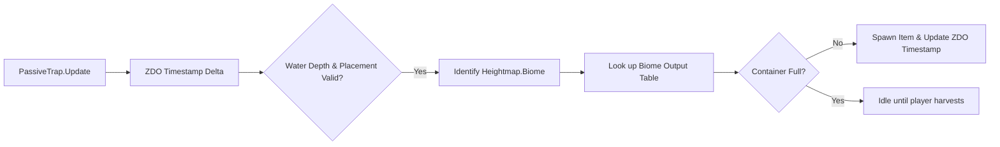

# BaitMeBruh: Technical Implementation Specification

This document provides the granular technical blueprints, mathematical formulas, and component architecture for the systems designed in [baitmebruh_planning.md](file:///home/vapok/.gemini/antigravity-ide/brain/11d76ef7-fd35-4ceb-a3c2-75ba64b14f1a/baitmebruh_planning.md).

---

## 1. Line Tension Engine & Mathematical Model

### State Variables
For any active fishing float with a hooked fish (`m_fishingFloat.GetCatch() != null`):
- $T \in [0.0, 1.0]$: Normalized line tension (0.0 = slack, 0.5 = optimal pull, 1.0 = line snap).
- $S \in \{0, 1\}$: Fish struggle flag (`Fish.IsEscaping()`).
- $R \in \{0, 1\}$: Player reeling input (`Player.IsBlocking()`).
- $Q \in [1, 5]$: Fish quality / star level.
- $K \in [0.0, 1.0]$: Player fishing skill factor (`Character.GetSkillFactor(Skills.SkillType.Fishing)`).
- $D_{rod}$: Rod tension damping modifier (Primitive = 1.0, Standard = 1.3, Reinforced = 1.6).

### Tension Dynamics Equation
On each physics frame (`FixedUpdate`, $dt = \text{fixedDeltaTime}$):

$$\frac{dT}{dt} = \text{TensionGain} - \text{TensionDissipation}$$

Where:
$$\text{TensionGain} = 
\begin{cases} 
0.65 \times \left(\frac{1 + 0.3 Q}{D_{rod}}\right) & \text{if } S = 1 \text{ and } R = 1 \text{ (Fighting the reel)} \\
0.15 \times \left(\frac{1 + 0.1 Q}{D_{rod}}\right) & \text{if } S = 1 \text{ and } R = 0 \text{ (Fish thrashing, line slack)} \\
0.10 \times \left(\frac{1}{D_{rod}}\right) & \text{if } S = 0 \text{ and } R = 1 \text{ (Reeling tired fish)} \\
0.0 & \text{if } S = 0 \text{ and } R = 0 \text{ (Resting)}
\end{cases}$$

$$\text{TensionDissipation} = 
\begin{cases} 
0.40 \times (1 + 0.5 K) & \text{if } R = 0 \text{ (Reel released)} \\
0.05 & \text{if } R = 1 \text{ (Actively reeling)}
\end{cases}$$

### Snap Condition
- If $T \ge 1.0$ for more than $0.5\text{s}$ continuously:
  - Trigger line snap effect (`m_lineBreakEffect`).
  - Drop fish catch (`SetCatch(null)`).
  - Consume bait.
  - Display HUD message `$msg_fishing_linebroke`.

### Stamina Drain Equation
Instead of vanilla's flat, crushing stamina drain:

$$\text{StaminaDrain} = 
\begin{cases} 
\left(6.0 + 8.0 \times T \times Q\right) \times (1 - 0.5 K) & \text{if } R = 1 \\
\left(1.0 + 1.5 \times T\right) \times (1 - 0.5 K) & \text{if } R = 0 \text{ and fish is hooked} \\
0.0 & \text{if line is empty}
\end{cases}$$

*Outcome*: Reeling while the fish is resting ($T \approx 0.15$) costs only $\sim 7\text{ stamina/sec}$ even for high-tier fish, while blindly holding reel during struggle ($T > 0.85$) rapidly drains $\sim 45+\text{ stamina/sec}$.

---

## 2. HUD & UI Rendering Architecture

### Crosshair Tension Arc (`FishingTensionHud`)
- **Parent**: `Hud.instance.m_crosshair.transform`
- **Component**: Custom uGUI radial arc or segmented progress bar created via procedurally spawned `Image` components.
- **Visual Presentation**:
  - Automatically fades in (`CanvasGroup.alpha` smoothly lerping to 1.0) when `m_fishingFloat.GetCatch() != null`.
  - Color gradient:
    - $T \in [0.0, 0.40]$: Soft Cyan / Green (`#4ade80`).
    - $T \in [0.40, 0.75]$: Amber Warning (`#facc15`).
    - $T \in [0.75, 1.00]$: Vibrant Red / Pulse (`#ef4444`).
  - Pulses rapidly when $T > 0.85$ accompanied by a low-frequency creaking audio cue.
  - Fades out cleanly upon fish catch or line release.

---

## 3. Passive Trap Production Systems

The **Bait Creel**, **Coastal Fish Net**, and **Deep-Sea Anchored Net** inherit from a clean, custom `PassiveTrap` component that attaches to a standard `ZNetView` and `Container` archetype.



### Production Parameters
| Piece Name | Biome Target | Sec Per Unit ($t_{cycle}$) | Max Capacity | Allowed Depth | Construction Cost |
| :--- | :--- | :--- | :--- | :--- | :--- |
| **Bait Creel** | Biome-specific `FishingBait*` | 360s (6 min) | 20 bait | $0.5\text{m} - 2.0\text{m}$ (Shallow) | 10 Wood, 4 FineWood, 2 Stone |
| **Coastal Fish Net** | Local freshwater & coastal fish | 900s (15 min) | 3 fish | $1.5\text{m} - 4.0\text{m}$ (Medium) | 10 CoreWood, 6 LeatherScraps, 4 BronzeNails, 2 Stone |
| **Deep-Sea Anchored Net** | Full biome & pelagic ocean fish | 600s (10 min) | 6 fish | $3.5\text{m} - 12.0\text{m}$ (Deep) | 10 AncientBark, 8 IronNails, 4 Guck, 2 Chain |

---

## 4. Complete Recipe Matrices

### A. Alternative Biome Bait Recipes (Batch size: 20)
Early bait crafting is unlocked at appropriate stations (`piece_workbench` for Meadows, `piece_cauldron` for subsequent biomes), removing the vanilla lock behind the Iron-tier Food Preparation Table:

| Bait Prefab | Biome | Crafting Station | Primary Ingredients |
| :--- | :--- | :--- | :--- |
| `FishingBait` | Meadows | `piece_workbench` (Lv 1) | 10x Resin + 2x Honey + 10x BoneFragments |
| `FishingBaitForest` | Black Forest | `piece_cauldron` (Lv 1) | 20x FishingBait + 4x TrollHide + 2x AncientSeed |
| `FishingBaitSwamp` | Swamp | `piece_cauldron` (Lv 2) | 20x FishingBait + 4x Bloodbag + 4x Entrails |
| `FishingBaitCave` | Mountain | `piece_cauldron` (Lv 2) | 20x FishingBait + 6x WolfFang + 2x FreezeGland |
| `FishingBaitPlains` | Plains | `piece_cauldron` (Lv 3) | 20x FishingBait + 4x Needle + 4x Cloudberry |
| `FishingBaitOcean` | Ocean | `piece_cauldron` (Lv 3) | 20x FishingBait + 6x Chitin + 2x SerpentMeat (or 1x TrophySerpent) |
| `FishingBaitMistlands` | Mistlands | `piece_cauldron` (Lv 4) | 20x FishingBait + 2x Carapace + 2x RoyalJelly |
| `FishingBaitAshlands` | Ashlands | `piece_cauldron` (Lv 5) | 20x FishingBait + 4x CharredBone + 2x SulfurStone |
| `FishingBaitDeepNorth` | Deep North | `piece_cauldron` (Lv 5) | 20x FishingBait + 4x FreezeGland + 4x Feathers |

### B. Whole-Fish Culinary & Alchemical Recipes

| Recipe Output | Station | Fish Consumed | Additional Ingredients | Duration / Effect |
| :--- | :--- | :--- | :--- | :--- |
| **Viking Fish Skewer** | Cooking Station | 1x Perch (`Fish1`) or Pike (`Fish2`) | None | 20 min; 35 HP, 25 Stamina |
| **Trollfish Chowder** | Cauldron 1 | 1x Trollfish (`Fish5`) | 2x YellowMushroom | 20 min; 15 HP, 45 Stamina, +10 Sneak |
| **Frost-Bite Mead Base** | Cauldron 2 | 1x Tetra (`Fish4_cave`) | 10x Honey, 5x Thistle, 2x WolfFang | Ferments into 6x Frost Resistance Mead |
| **Swamp Broth** | Cauldron 2 | 1x Giant Herring (`Fish6`) | 4x Bloodbag, 2x Guck | 25 min; 55 HP, 30 Stamina, +25% HP Regen |
| **Mariner's Stew** | Cauldron 3 | 1x Tuna (`Fish3`) | 2x BarleyFlour, 2x Cloudberry | 30 min; 30 HP, 75 Stamina, -30% Swim Stamina |
| **Puffer Toxic Extract** | Fermenter | 1x Pufferfish (`Fish12`) | 10x Ooze, 2x Guck | Yields 10x Poison Coating (+50 Poison dmg to ammo/weapons) |
| **Glowfin Ration** | Cauldron 4 | 1x Anglerfish (`Fish9`) | 2x Magecap, 1x RoyalJelly | 30 min; 35 HP, 40 Stamina, 60 Eitr, Ambient Glow |
| **Cinderfish Fillet** | Cauldron 5 | 1x Magmafish (`Fish11`) | 2x Fiddleheadfern, 1x SpiceAshlands | 35 min; 85 HP, 40 Stamina, Cold Immunity |

---

## 5. Harmony Patch Call Trees

### `FishingFloat.FixedUpdate` Call Hierarchy
```
FishingFloat.FixedUpdate()
├── GetOwner()
├── GetCatch()
├── UpdateLineTension(owner, fish)   <-- Custom Tension Engine
├── HandleStruggleAndRest(fish)      <-- Escape cycle dampening
├── UpdateHudGauge(tension)          <-- UI Arc update
├── CheckLineSnap(tension)           <-- Snap safety logic
└── CheckCatchArrival(distance)      <-- Triggers FishingFloat.Catch()
```

### `Fish.Interact` Pickup Redirection Hierarchy
```
Fish.Interact(user, hold, alt)
└── IsHooked()
    ├── True  --> FishingFloat.FindFloat(this).Catch(this, user)
    └── False --> Fish.Pickup(user)
```
