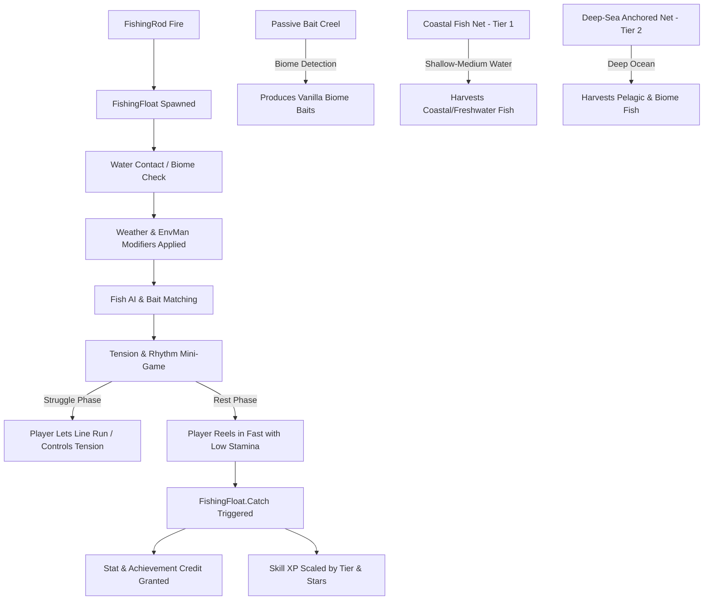

# GreatCatchBruh: Comprehensive Fishing System Overhaul

## 1. Executive Summary & Core Identity

**GreatCatchBruh** is an end-to-end overhaul of Valheim's fishing experience designed to transform an underutilized, frustrating chore into an engaging, rewarding, and authentic Viking livelihood.

### Mod Pillars & Standards
- **Part of the Vapok Modding Suite**: Follows the architectural standards of `BetterSleepBruh`, `DoorOpenerBruh`, and `WardMeBruh`, integrating directly with `Vapok.Common` and utilizing `ConfigSyncBase` for server-authoritative configuration.
- **Zero Vanilla Item Bloat**: 100% utilizes vanilla item prefabs for fish (`Fish1`–`Fish12`), baits (`FishingBait*`), monster trophies, and cooking ingredients.
- **Zero AssetBundle Fragility**: Build pieces (Bait Creel and Fish Net) are procedurally constructed by assembling vanilla prefabs and components (e.g. woven wicker, wooden barrels/crates, hanging rope netting). This eliminates Unity 6 point-release serialization incompatibilities entirely.
- **Skill & Rhythm Over Raw Stamina**: Replaces the brute-force stamina drain with a dynamic tension and struggle/rest system where player timing and patience matter more than having a 350-point end-game stamina bar.
- **Early-Game Accessibility**: Introduces a craftable **Primitive Fishing Rod** at Workbench Tier 1 so players can fish in the Meadows before locating Haldor.
- **Ecological & Seafaring Immersion**: Integrates weather systems (rain, storms, time of day), seafaring (trolling from boats, passenger fishing), and regional biomes (passive traps harvesting regional bait and fish).
- **Achievement & Progression Fidelity**: Preserves and properly triggers all vanilla fishing achievements, statistics (`FishCaught`, `FishLost`, `FishHooked`), and the Fishing Hat unlock, fixing vanilla bugs where picking up landed fish fails to award credit.

---

## 2. Detailed System Designs

### Pillar 1: The Tension & Rhythm Mini-Game Overhaul

#### The Problem in Vanilla
In vanilla `FishingFloat.cs`, reeling is a continuous stamina penalty:
$$\text{Drain} = (10 + \text{FishStamina} \times \text{Quality}) \times \text{SkillMultiplier}$$
A quality 5 fish drains 35–45 stamina/second. If stamina reaches zero, the line snaps instantly. To survive, players either chug stamina potions or sprint backwards onto shore to drag the fish onto dry land.

#### The GreatCatchBruh Solution
1. **Dynamic Struggle vs. Rest States**:
   - **Struggle Phase (Fish Escaping)**: The fish splashes violently and fights the line.
     - *Reeling during struggle*: Spikes line tension, drains stamina rapidly, and risks line breakage.
     - *Letting the line run / feathering*: Minimal stamina drain, line tension stays stable, fish slowly tires itself out.
   - **Rest Phase (Fish Exhausted)**: The fish stops fighting for 2–5 seconds.
     - *Reeling during rest*: Fast pull speed, minimal stamina drain (scaled down by 75–80%).
   - *Result*: A player with only 100 base stamina can land a high-tier or 5-star fish by reading the fish's behavior and reeling only during rest windows.
2. **Visual & Audio Feedback**:
   - A minimalist, vanilla-styled Line Tension Gauge rendered near the crosshair or floating above the rod tip:
     - **Green (Slack/Safe)**: Line is healthy, fish is calm or spooling safely.
     - **Yellow (Moderate Tension)**: Optimal pull range.
     - **Red / Flashing (Critical Tension)**: Line near breaking point; release reel immediately.
   - Distinct audio cues (creaking reel friction, water thrashing) allowing players to fish by ear.
3. **Fair Hook Timing**:
   - Expand the vanilla 0.5s nibble reaction window based on Fishing Skill (e.g. 0.8s base up to 1.5s at high skill), eliminating lag-induced misses on dedicated servers.
4. **Shoreline Pickup & Achievement Bug Fix**:
   - In vanilla, grabbing a hooked fish via `E` (Interact) triggers `Fish.Pickup()` rather than `FishingFloat.Catch()`, skipping achievements and recipe unlocks.
   - Patch `Fish.Interact` / `Fish.Pickup`: If the fish is currently hooked (`IsHooked()`), automatically route through `FishingFloat.Catch()` to register stat increments (`FishCaught`, star tiers) and trigger hat progress.

---

### Pillar 2: Rod Progression (Early Game to Master)

| Rod Prefab / Tier | Crafting / Source | Max Distance | Tension Resistance | Reel Speed | Description |
| :--- | :--- | :--- | :--- | :--- | :--- |
| **Primitive Fishing Rod** | Workbench Lv 1 (5 Wood, 4 Leather Scraps, 2 Bone Fragments) | 16m | Base | 1.0 m/s | A simple hazel switch with bone hook and gut line. Perfect for Meadows streams. |
| **Standard Fishing Rod** | Haldor (350 Coins) | 30m | +30% | 1.5 m/s | Fine merchant rod with reinforced core and flexible tip. Capable of deep casting. |
| **Reinforced Angler Rod** | Forge Lv 3 (Standard Rod + 4 Bronze + 2 Fine Wood + 4 Chitin) | 40m | +60% | 2.0 m/s | Reinforced with sea-chitin guides; exceptional line spooling and ocean trolling tolerance. |

---

### Pillar 3: Bait Economy & Passive Harvesting

#### 1. Bait Crafting Overhaul (Decoupled from Rare Mini-Bosses & Iron-Locked Tables)
Vanilla requires burning rare trophies (Abominations, Fenrings, Serpents) for a paltry 20 bait, and restricts crafting to the Iron-tier Food Preparation Table (`piece_preptable`). GreatCatchBruh introduces early-accessible recipes using abundant monster drops at appropriate stations:
- **Meadows** (`piece_workbench` Lv 1): Resin, honey, bone fragments (crafts basic `FishingBait` without needing to find Haldor).
- **Black Forest** (`piece_cauldron` Lv 1): Troll hide, ancient seeds, bone fragments (replaces mandatory Troll Trophy).
- **Swamp** (`piece_cauldron` Lv 2): Leech bloodbags, entrails, guck (replaces mandatory Abomination Trophy).
- **Mountain** (`piece_cauldron` Lv 2): Wolf fangs, freeze glands (replaces mandatory Fenring Trophy).
- **Plains** (`piece_cauldron` Lv 3): Needles, cloudberries, chitin (replaces mandatory Fuling Trophy).
- **Ocean** (`piece_cauldron` Lv 3): Chitin, serpent meat (alternative to rare Serpent Trophy).
- **Mistlands** (`piece_cauldron` Lv 4): Hare meat, royal jelly, carapace (alternative to Lox Trophy).
- **Ashlands** (`piece_cauldron` Lv 5): Charred bones, sulfur stone, glow worms.
- **Deep North** (`piece_cauldron` Lv 5): Freeze glands, feathers.

#### 2. Passive Biome Bait Creel (Build Piece)
- **Visual Construction**: Procedurally assembled from vanilla wicker basket / crate models with stone weights.
- **Placement**: Placed in shallow water along coastlines or riverbanks (Workbench requirement).
- **Mechanic**:
  - Operates on standard production loop (`Container` / `Beehive` archetype with ZDO timestamps).
  - Inspects `Heightmap.Biome` and slowly yields the corresponding vanilla bait (max stack: 20):
    - Meadows $\rightarrow$ `FishingBait`
    - Black Forest $\rightarrow$ `FishingBaitForest`
    - Swamp $\rightarrow$ `FishingBaitSwamp`
    - Mountain (lakes/caves) $\rightarrow$ `FishingBaitCave`
    - Plains $\rightarrow$ `FishingBaitPlains`
    - Ocean/Coast $\rightarrow$ `FishingBaitOcean`
    - Mistlands $\rightarrow$ `FishingBaitMistlands`
    - Ashlands $\rightarrow$ `FishingBaitAshlands`
    - Deep North $\rightarrow$ `FishingBaitDeepNorth`

#### 3. Passive Fish Net Progression (Two-Tiered Coastal & Deep Water Traps)
Rather than a single static piece, fish trapping evolves with seafaring and metal ages:

1. **Tier 1: Coastal Fish Net (`piece_fishnet_coastal`)**
   - **Progression / Station**: Black Forest (`piece_workbench` Lv 2 / `forge` Lv 1). Unlocks alongside the Karve and Bronze Age.
   - **Placement**: Placed in shallow-to-medium coastal waters and river mouths ($1.5\text{m} - 4.0\text{m}$ depth). Accessible from docks or by wading/swimming.
   - **Construction Materials**:
     - `10x CoreWood` (Buoyant pine float frame)
     - `6x LeatherScraps` (Tough twine netting)
     - `4x BronzeNails` (Reinforced frame joinery)
     - `2x Stone` (Anchor sinkers)
   - **Production**: Yields 1 fish every 900s (15 min), up to a max capacity of 3 fish. Catches common local coastal/river species (e.g. Perch `Fish1`, Pike `Fish2`, Trollfish `Fish3`).

2. **Tier 2: Deep-Sea Anchored Net (`piece_fishnet_deep`)**
   - **Progression / Station**: Swamp (`forge` Lv 2 / `piece_workbench` Lv 3). Unlocks alongside the Longship and Iron Age.
   - **Placement**: Placed in deeper coastal shelves and open ocean ($3.5\text{m} - 12.0\text{m}$ depth), deployed from ships.
   - **Construction Materials**:
     - `10x AncientBark` (Rot-resistant deep water timber)
     - `8x IronNails` (Heavy-duty marine fasteners)
     - `4x Guck` or `8x DeerHide` (Tarred water-resistant rigging)
     - `2x Chain` or `4x Stone` (Heavy ocean mooring weights)
   - **Production**: Yields 1 fish every 600s (10 min), up to a max capacity of 6 fish. Capable of catching deep-water and ocean pelagic species (e.g. Giant Herring `Fish5`, Tuna `Fish6`, Coral Ostracod `Fish7`).

---

### Pillar 4: Fish Butchering, Food & Mead Economy

#### 1. Generous Star-Tier Butchering Yields
In vanilla, a size 5 fish yields only 5 generic `FishRaw`. We re-curve butchering yields to reward landing trophy-sized fish:
- **Quality 1 (Normal)**: 2x `FishRaw`
- **Quality 2 (1-Star)**: 4x `FishRaw`
- **Quality 3 (2-Star)**: 8x `FishRaw`
- **Quality 4 (3-Star)**: 14x `FishRaw`
- **Quality 5 (4-Star Trophy)**: 20x `FishRaw` + chance for bonus resources (Pearls, Amber Pearls, Coins).

#### 2. Species-Specific Culinary & Alchemical Recipes
Instead of turning every fish into generic `FishRaw`, players can use whole fish in unique recipes:
- **Perch & Pike**: *Viking Fish Skewer* (Early Meadows health/stamina staple cooked directly on cooking station).
- **Trollfish**: *Trollfish Chowder* (Cauldron Tier 2: +Sneak bonus & stamina).
- **Tetra**: *Frost-Bite Mead* (Cauldron mead base fermented in Fermenter: Frost resistance mead utilizing whole Tetra fish).
- **Giant Herring**: *Swamp Broth* (Cauldron Tier 2: Poison resistance & HP regen).
- **Coral Ostracod**: *Mariner's Stew* (Cauldron Tier 3: Swimming stamina reduction & speed).
- **Pufferfish**: *Puffer Toxic Brew* (Fermenter: High-potency poison coating for arrows & weapons).
- **Anglerfish**: *Glowfin Ration* (Cauldron Tier 4: Eitr regeneration & subtle ambient luminescence).
- **Magmafish**: *Cinderfish Fillet* (Food prep: Warmth / cold immunity in mountain/deep north).

---

### Pillar 5: Seafaring & Boat Fishing Integration

#### 1. Seated Angling on Ships
- In vanilla, interacting with a ship seat triggers `Player.AttachStart` with `hideWeapons = true`, hiding the rod.
- **GreatCatchBruh Enhancement**:
  - Allow players seated on ship benches to equip and cast their Fishing Rod.
  - Adjust the player animation to a relaxed seated angling pose.
  - Position camera clearance so masts and sails do not obstruct the view of the float.

#### 2. Ship Trolling Dynamics
- When the player is on a moving ship:
  - Dynamically scale line breaking distance with ship velocity.
  - Spool line behind the ship wake, mimicking genuine ocean trolling.
  - Open-ocean pelagic fish (Serpent-attracted fish, Coral Ostracod, Pufferfish) have increased attraction ranges for trolling lures.

---

### Pillar 6: Weather & Environmental Modifiers

| Weather / Condition | Mechanic Effect | Flavor / Reason |
| :--- | :--- | :--- |
| **Rain / Storm (`m_isWet`)** | +50% Bite Rate, +25% Nibble Frequency | Insects knocked into water; surface chop masks line. |
| **Thunderstorm** | Increased chance for higher quality fish (Stars 3–5) | Deep-sea monsters and leviathans rise near surface. |
| **Fog (`m_isFoggy`)** | +30% Attraction Range | Low light calms fish, reducing flight/escape chance. |
| **Dawn & Dusk (`s_dawnDusk`)** | Peak feeding activity (+40% Hook Window) | Primary predatory feeding hour. |
| **Nighttime** | Nocturnal species emerge; cave/swamp fish bite faster | Predators hunt in darkness. |

---

### Pillar 7: Skill Progression & Fishing Hat Rework

#### 1. Meaningful XP Acquisition
- **Old System**: 1 tick/second only while holding right-click reel. Zero XP for catching fish.
- **New System**:
  - **Hooking a Fish**: Base XP grant.
  - **Fighting a Fish**: Steady XP grant during line management.
  - **Landing/Catching a Fish**: Major XP burst scaled by:
    $$\text{XP} = \text{BaseXP} \times \text{BiomeTierMultiplier} \times \text{FishQuality}$$

#### 2. Tiered Fishing Hat Progression
- **Apprentice Angler Hat**: Unlocked after catching 3 distinct fish species (+10 Skill).
- **Journeyman Angler Hat**: Unlocked after catching 7 distinct fish species (+15 Skill).
- **Master Angler Hat**: Unlocked after catching all 12 species (+25 Skill, +20 Swim).
  - *Active Master Perks*:
    - **Angler's Eye**: Fish within 15 meters emit subtle underwater silhouettes.
    - **Master's Touch**: 25% chance to not consume bait on catch.
    - **Tension Cushion**: Increases line snap tolerance by +30%.

---

## 3. Technical Architecture & Patch Targets

### Harmony Patch Targets
1. **`FishingFloatPatches`**:
   - `Prefix` / `Transpiler` on `FixedUpdate`: Replace linear stamina drain with tension/struggle logic.
   - `Postfix` on `TryToHook`: Expand hook window and integrate weather bonuses.
   - `Prefix` / `Postfix` on `Catch`: Ensure comprehensive stat recording and event dispatch.
2. **`FishPatches`**:
   - `Postfix` on `Interact` / `Pickup`: Redirect hooked fish pickups to `FishingFloat.Catch()`.
   - `Postfix` on `Update`: Inject weather-based swim range and attraction speed.
3. **`PlayerPatches` & `ShipPatches`**:
   - Patch `Player.AttachStart` and `Player.UpdateAttach`: Allow fishing rod holding and casting while seated on ships.
   - Patch `FishingFloat.FixedUpdate`: Add boat trolling distance compensation.
4. **`Piece` Components**:
   - Custom `BaitTrap` and `PassiveTrap` (`FishNetCoastal`, `FishNetDeep`) components inheriting standard production logic (`Container` / `Beehive` archetype).

---

## 4. Phased Implementation Roadmap

- [x] **Phase 1: Foundation & Mini-Game Core**
  - [x] Implement Tension & Struggle/Rest mechanics in `FishingFloat`.
  - [x] Fix pickup/achievement bug in `Fish.Interact`.
  - [x] Rebalance XP progression on hook and catch.
- [x] **Phase 2: Rod & Bait Progression**
  - [x] Register `Primitive Fishing Rod` at Workbench Tier 1.
  - [x] Implement alternative Cauldron bait recipes using common monster drops.
- [x] **Phase 3: Weather & Seafaring Integration**
  - [x] Integrate `EnvMan` weather and time-of-day bonuses.
  - [x] Allow passenger rod equipping and casting while seated on ships.
  - [x] Implement line trolling dynamics for moving vessels.
- [ ] **Phase 4: Passive Harvesting Build Pieces**
  - Assemble and register `BaitTrap` (Biome Creel), `Coastal Fish Net` (Tier 1), and `Deep-Sea Anchored Net` (Tier 2) using vanilla visual assets.
  - Implement regional automated production loops with water depth constraints.
- [ ] **Phase 5: Culinary, Alchemical & Hat Expansion**
  - Expand star-tier butchering yields and add whole-fish recipes (meads, stews, skewers).
  - Rebalance `HelmetFishingHat` tiered progression and master perks.
  - Full configuration registry setup with server-sync via `ConfigSyncBase`.
